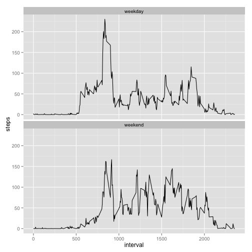

### Introduction
This assignment makes use of data from a personal activity monitoring device. This device collects data at 5 minute intervals through out the day. The data consists of two months of data from an anonymous individual collected during the months of October and November, 2012 and include the number of steps taken in 5 minute intervals each day.

This analysis comprises Assessment 1 from Coursera course Reproducible Research

### 1. Loading and preprocessing the data


```r
  #Read in the data and clean
  data <- read.csv('activity.csv')
  data <- data[!is.na(data$steps), ]
```

### 2. What is mean total number of steps taken per day?


```r
  #Calculate the number of steps per day
  require(plyr)
  steps_per_day <- ddply(data, ~date, summarise, total = sum(steps))
  hist(steps_per_day$total)
```

 

```r
#Mean number of steps per day
  mean(steps_per_day$total)
```

```
## [1] 10766.19
```

```r
#Mean number of steps per day
  median(steps_per_day$total)
```

```
## [1] 10765
```

### 3. What is the average daily activity pattern?

```r
#Find the mean steps at each time period
  steps_at_time <- ddply(data, ~interval, summarise, steps = mean(steps))

#Then plot this as a graph using ggplot
require(ggplot2)
  ggplot(steps_at_time, aes(x = interval, y = steps)) + geom_line() 
```

 

Which interval across all days has the highest average step count?

```r
steps_at_time$interval[steps_at_time$steps == max(steps_at_time$steps)]
```

```
## [1] 835
```
8.35-8.40 in the morning

### 4. Imputing missing values
In the previous analysis I removed all rows with missing data. Quickly we will return to the raw data and check these values


```r
  #Get the data back
    data2 <- read.csv('activity.csv')
  #Total missing values
    sum(is.na(data2))
```

```
## [1] 2304
```

#### Strategy
Above I calculated the interval step average. These values (rounded to the nearest whole number) are used to fill in the missing data. 


```r
#Substitude the average value if original is missing
  na.alternative <- sapply(data2$interval, function (x) round( steps_at_time$steps[steps_at_time$interval == x])) 
  data2$steps[is.na(data2$steps)] <- na.alternative[is.na(data2$steps)]
```

The analysis from step 2 is repeated with the new data set

```r
  steps_per_day <- ddply(data2, ~date, summarise, total = sum(steps))
  hist(steps_per_day$total)
```

 

```r
#Mean number of steps per day
  mean(steps_per_day$total)
```

```
## [1] 10765.64
```

```r
#Mean number of steps per day
  median(steps_per_day$total)
```

```
## [1] 10762
```

There is a slight drop in both mean and median but nothing drastic

### Are there differences in activity patterns between weekdays and weekends?
With this section we are looking at the general shift in activity pattern between weekdays and weekends


```r
  #Begin by creating a variable that stores Weekend
    data2$weekday <- weekdays(as.Date(data2$date, "%Y-%m-%d"))
    weekend <- c('Saturday', 'Sunday')
    data2$weekday <- ifelse(data2$weekday %in% weekend, 'weekend', 'weekday')
    data2$weekday <- factor(data2$weekday)
```

```r
#Calculate mean steps at each time per day type
  steps_at_time_day <- ddply(data2, ~interval + weekday, summarise, steps = mean(steps))
#Then plot this as a graph using ggplot
  ggplot(steps_at_time_day, aes(x = interval, y = steps)) + geom_line() + facet_wrap( ~ weekday, ncol = 1 )
```

 
